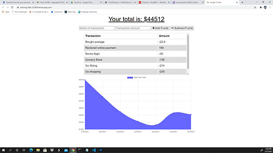

# Budget Tracker

## Description:

The user will be able to add expenses and deposits to their budget with or without a connection. When entering transactions offline, they should populate the total when brought back online to the database.

Offline Functionality:

- Enter deposits offline

- Enter expenses offline

When brought back online:

- Offline entries should be added to tracker.

---

> ## Table of Contents

- [Installation](#installation)
- [Usage](#usage)
- [Contributing](#contributing)
- [Tests](#tests)
- [Questions](#questions)

## Installation:

To install necessary dependencies run the following command:

> npm i

## Usage Information:

Application is deployed to a Heroku URL with MongoDB Atlas database for user to demo full functionality. If you want to run locally you must install all dependencies and setup your MongoDB database connection. Click the screenshot to visit the deployed URL.

> 

## Contributing Information:

Nothing at this time

## Tests:

To run tests, run the following command:

> n/a

## Questions:

---

> Creator Github account: [Kasey Raymond](https://api.github.com/users/KcRaymond)

> Email Creator: [kaseyleigh1978@gmail.com](mailto:)
